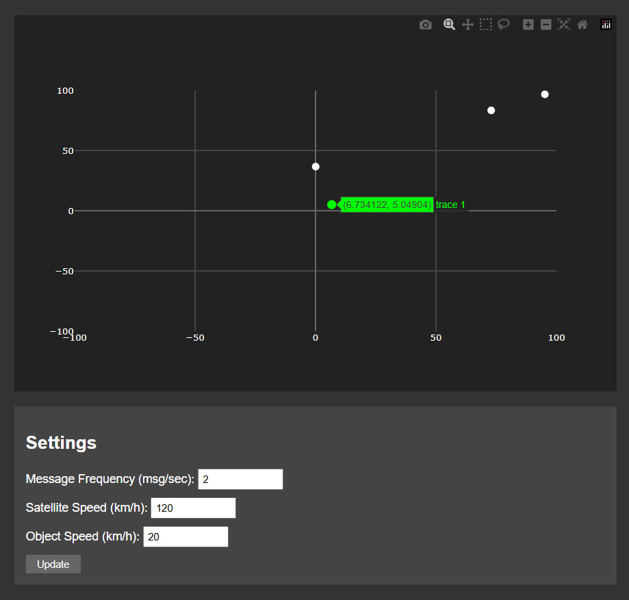

# Лабораторна робота №5: GPS навігація та трилатерація

## Мета роботи
Розробити систему для візуалізації даних GPS навігації з використанням методу трилатерації, реалізувати обробку даних від емульованої вимірювальної частини GPS та забезпечити відображення положення об'єкта і супутників на графіку в декартових координатах.

## Теоретичні відомості
Принцип роботи GPS базується на методі трилатерації, що дозволяє визначити положення об'єкта шляхом вимірювання відстаней до кількох точок з відомими координатами. Для роботи системи у двовимірному просторі необхідно мати дані щонайменше від трьох супутників. Кожен супутник формує сферу можливого розташування об'єкта, а точка перетину цих сфер визначає реальне положення об'єкта у просторі. Математична модель системи використовує рівняння кіл для знаходження точки перетину, враховуючи координати супутників та виміряні відстані до них.

## Розробка системи візуалізації
У розробленому додатку реалізовано візуалізацію даних GPS у режимі реального часу з використанням декартової системи координат. Система отримує дані через WebSocket з'єднання від емулятора GPS та відображає поточне положення об'єкта та супутників на графіку. Інтерфейс користувача дозволяє налаштовувати різні параметри системи, такі як частота оновлення даних, швидкість руху супутників та об'єкта спостереження.

## Результати роботи

**Базова конфігурація системи:**

За початкових налаштувань система демонструє стабільну роботу з такими параметрами: частота передачі повідомлень встановлена на рівні 2 повідомлення на секунду, швидкість руху супутників складає 120 км/год, а швидкість об'єкта - 20 км/год. На графіку чітко видно розташування трьох супутників (білі точки) та відстежуваного об'єкта (зелена точка). Супутники утворюють оптимальну геометричну конфігурацію для точного визначення положення об'єкта, що підтверджується стабільністю показань координат.

**Вплив зміни параметрів на роботу системи:**
При збільшенні частоти передачі повідомлень спостерігається більш плавне оновлення позиції об'єкта на графіку, проте це призводить до збільшення навантаження на систему обробки даних. Зміна швидкості руху супутників впливає на конфігурацію супутникового сузір'я - при високих швидкостях геометрія розташування супутників змінюється швидше, що може як покращити, так і погіршити точність визначення позиції об'єкта в залежності від конкретної ситуації.
При значному збільшенні швидкості об'єкта система продовжує ефективно відслідковувати його положення. Це демонструє надійність алгоритму трилатерації навіть при роботі з об'єктами, що швидко рухаються. Геометрія розташування супутників забезпечує стабільне визначення координат об'єкта, незважаючи на його високу динаміку руху.

## Висновки
Розроблена система успішно реалізує функціонал GPS-навігації та демонструє стабільну роботу при різних режимах експлуатації. Інтерактивний інтерфейс дозволяє ефективно досліджувати вплив різних параметрів на точність визначення координат об'єкта. Практична реалізація алгоритму трилатерації підтверджує теоретичні розрахунки та демонструє надійність методу для визначення положення об'єктів у просторі. Система зберігає працездатність навіть при значних швидкостях руху об'єкта, що підтверджує її практичну цінність для різноманітних застосувань у сфері навігації та відстеження об'єктів.
